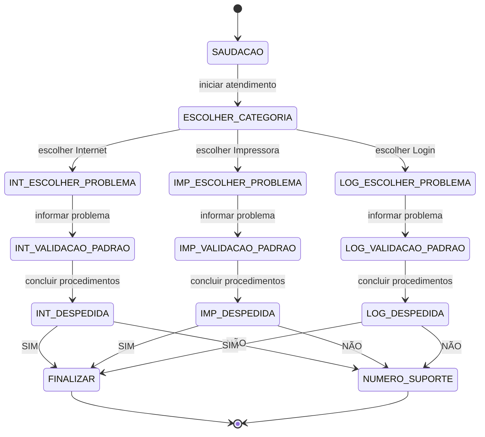

# Chatbot de Suporte Basico com Autômato Finito Determinístico (DFA)

## 🎯 Objetivo
Demonstrar estados, transições e ações usando um DFA que guia o usuário da saudação até a identificação e solução primária do seu problema técnico (Internet, Impressora ou Login no 365) e finalização.

---

## Diagrama de Estados (Mermaid)


---

## 📊 Tabela de Estados e Transições
| **Estado**                | **Ação do Usuário**                  | **Próximo Estado**           |
|---------------------------|--------------------------------------|------------------------------|
| SAUDACAO                 | iniciar atendimento                 | ESCOLHER_CATEGORIA          |
| ESCOLHER_CATEGORIA       | escolher Internet                   | INT_ESCOLHER_PROBLEMA       |
| ESCOLHER_CATEGORIA       | escolher Impressora                 | IMP_ESCOLHER_PROBLEMA       |
| ESCOLHER_CATEGORIA       | escolher Login                      | LOG_ESCOLHER_PROBLEMA       |
| INT_ESCOLHER_PROBLEMA    | informar problema de Internet       | INT_VALIDACAO_PADRAO        |
| INT_VALIDACAO_PADRAO     | concluir procedimentos              | INT_DESPEDIDA               |
| INT_DESPEDIDA            | SIM                                 | FINALIZAR                   |
| INT_DESPEDIDA            | NÃO                                 | NUMERO_SUPORTE              |
| IMP_ESCOLHER_PROBLEMA    | informar problema de Impressora     | IMP_VALIDACAO_PADRAO        |
| IMP_VALIDACAO_PADRAO     | concluir procedimentos              | IMP_DESPEDIDA               |
| IMP_DESPEDIDA            | SIM                                 | FINALIZAR                   |
| IMP_DESPEDIDA            | NÃO                                 | NUMERO_SUPORTE              |
| LOG_ESCOLHER_PROBLEMA    | informar problema de Login          | LOG_VALIDACAO_PADRAO        |
| LOG_VALIDACAO_PADRAO     | concluir procedimentos              | LOG_DESPEDIDA               |
| LOG_DESPEDIDA            | SIM                                 | FINALIZAR                   |
| LOG_DESPEDIDA            | NÃO                                 | NUMERO_SUPORTE              |
| FINALIZAR                | -                                   | FIM                          |
| NUMERO_SUPORTE           | -                                   | FIM                          |

---

## 💬 Exemplos de Conversas

### ✅ Exemplo 1 — Internet, problema resolvido (SIM → FINALIZAR)
**Bot (SAUDACAO):** Olá! Bem-vindo ao suporte. Escolha uma categoria: Internet, Impressora ou Login.  
**Usuário:** Internet  
**Bot (ESCOLHER_PROBLEMA):** Qual é o problema com a Internet?  
**Usuário:** A conexão está lenta.  
**Bot (Validacao Padrao):** Tente reiniciar o roteador e verificar os cabos. O problema foi resolvido?  
**Usuário:** Sim.  
**Bot (DESPEDIDA → FINALIZAR):** Obrigado por usar nosso suporte. Até mais!  
**(FIM)**

---

### ✅ Exemplo 2 — Impressora, problema não resolvido (NÃO → NUMERO_SUPORTE)
**Bot (SAUDACAO):** Olá! Bem-vindo ao suporte. Escolha uma categoria: Internet, Impressora ou Login.  
**Usuário:** Impressora  
**Bot (ESCOLHER_PROBLEMA):** Qual é o problema com a impressora?  
**Usuário:** Não está imprimindo.  
**Bot (Validacao Padrao):** Verifique se está ligada e conectada. O problema foi resolvido?  
**Usuário:** Não.  
**Bot (DESPEDIDA → NUMERO_SUPORTE):** Entre em contato com o suporte: (xx) xxxx-xxxx. Obrigado!  
**(FIM)**

---

### ✅ Exemplo 3 — Login, problema resolvido (SIM → FINALIZAR)
**Bot (SAUDACAO):** Olá! Bem-vindo ao suporte. Escolha uma categoria: Internet, Impressora ou Login.  
**Usuário:** Login  
**Bot (ESCOLHER_PROBLEMA):** Qual é o problema com o login?  
**Usuário:** Esqueci minha senha.  
**Bot (Validacao Padrao):** Acesse o link de recuperação e redefina sua senha. O problema foi resolvido?  
**Usuário:** Sim.  
**Bot (DESPEDIDA → FINALIZAR):** Atendimento concluído. Obrigado!  
**(FIM)**


## Código em Java

```java
// ChatbotSuporteTecnicoDFA.java
import java.util.Scanner;

public class ChatbotSuporteTecnicoDFA {
    enum State {
        SAUDACAO,
        ESCOLHER_CATEGORIA,
        INT_ESCOLHER_PROBLEMA,
        INT_VALIDACAO_PADRAO,
        INT_DESPEDIDA,
        IMP_ESCOLHER_PROBLEMA,
        IMP_VALIDACAO_PADRAO,
        IMP_DESPEDIDA,
        LOG_ESCOLHER_PROBLEMA,
        LOG_VALIDACAO_PADRAO,
        LOG_DESPEDIDA,
        NUMERO_SUPORTE,
        FINALIZAR
    }

    public static void main(String[] args) {
        Scanner sc = new Scanner(System.in);
        State state = State.SAUDACAO;
        String categoria = null;
        String problema = null;

        System.out.println("=== CHATBOT DE SUPORTE TÉCNICO ===");
        System.out.println("Bot: Olá! Bem-vindo ao suporte técnico.\n");

        while (true) {
            String input = sc.nextLine().trim().toLowerCase();

            switch (state) {
                case SAUDACAO:
                    state = State.ESCOLHER_CATEGORIA;
                    System.out.println("Bot: Escolha uma categoria:");
                    System.out.println("  1 - Internet");
                    System.out.println("  2 - Impressora");
                    System.out.println("  3 - Login no 365");
                    System.out.print("> ");
                    break;

                case ESCOLHER_CATEGORIA:
                    if (input.contains("internet") || input.equals("1")) {
                        categoria = "Internet";
                        state = State.INT_ESCOLHER_PROBLEMA;
                        System.out.println("\nBot: Você escolheu Internet.");
                        System.out.println("Bot: Qual é o problema com a Internet?");
                        System.out.println("  - Conexão lenta");
                        System.out.println("  - Sem conexão");
                        System.out.println("  - Conexão intermitente");
                        System.out.print("> ");
                    } else if (input.contains("impressora") || input.equals("2")) {
                        categoria = "Impressora";
                        state = State.IMP_ESCOLHER_PROBLEMA;
                        System.out.println("\nBot: Você escolheu Impressora.");
                        System.out.println("Bot: Qual é o problema com a impressora?");
                        System.out.println("  - Não está imprimindo");
                        System.out.println("  - Impressão com falhas");
                        System.out.println("  - Impressora offline");
                        System.out.print("> ");
                    } else if (input.contains("login") || input.contains("365") || input.equals("3")) {
                        categoria = "Login no 365";
                        state = State.LOG_ESCOLHER_PROBLEMA;
                        System.out.println("\nBot: Você escolheu Login no 365.");
                        System.out.println("Bot: Qual é o problema com o login?");
                        System.out.println("  - Esqueci minha senha");
                        System.out.println("  - Conta bloqueada");
                        System.out.println("  - Erro ao fazer login");
                        System.out.print("> ");
                    } else {
                        System.out.println("Bot: Opção inválida. Digite 1, 2 ou 3.");
                        System.out.print("> ");
                    }
                    break;

                // ========== FLUXO INTERNET ==========
                case INT_ESCOLHER_PROBLEMA:
                    problema = input;
                    state = State.INT_VALIDACAO_PADRAO;
                    System.out.println("\nBot: Entendi. Problema: " + problema);
                    System.out.println("Bot: Siga estas instruções:");
                    System.out.println("  1. Reinicie o roteador (desligue por 30 segundos)");
                    System.out.println("  2. Verifique se os cabos estão conectados corretamente");
                    System.out.println("  3. Teste a conexão em outro dispositivo");
                    System.out.println("\nBot: O problema foi resolvido? (sim/não)");
                    System.out.print("> ");
                    break;

                case INT_VALIDACAO_PADRAO:
                    if (input.contains("sim") || input.equals("s")) {
                        state = State.INT_DESPEDIDA;
                        System.out.println("\nBot: Ótimo! Fico feliz em ajudar.");
                        state = State.FINALIZAR;
                        System.out.println("Bot: Atendimento concluído. Obrigado por usar nosso suporte!");
                        System.out.println("Bot: Até mais!");
                        sc.close();
                        return;
                    } else if (input.contains("não") || input.contains("nao") || input.equals("n")) {
                        state = State.NUMERO_SUPORTE;
                        System.out.println("\nBot: Lamento que o problema persista.");
                        System.out.println("Bot: Entre em contato com nosso suporte especializado:");
                        System.out.println("Bot: Telefone: (62) 3241-5555");
                        System.out.println("Bot: E-mail: suporte@empresa.com.br");
                        System.out.println("\nBot: Obrigado pelo contato!");
                        sc.close();
                        return;
                    } else {
                        System.out.println("Bot: Por favor, responda com 'sim' ou 'não'.");
                        System.out.print("> ");
                    }
                    break;

                // ========== FLUXO IMPRESSORA ==========
                case IMP_ESCOLHER_PROBLEMA:
                    problema = input;
                    state = State.IMP_VALIDACAO_PADRAO;
                    System.out.println("\nBot: Entendi. Problema: " + problema);
                    System.out.println("Bot: Siga estas instruções:");
                    System.out.println("  1. Verifique se a impressora está ligada");
                    System.out.println("  2. Confirme se está conectada ao computador/rede");
                    System.out.println("  3. Verifique se há papel e tinta/toner");
                    System.out.println("  4. Tente remover e reinstalar a impressora");
                    System.out.println("\nBot: O problema foi resolvido? (sim/não)");
                    System.out.print("> ");
                    break;

                case IMP_VALIDACAO_PADRAO:
                    if (input.contains("sim") || input.equals("s")) {
                        state = State.FINALIZAR;
                        System.out.println("\nBot: Excelente! Sua impressora está funcionando novamente.");
                        System.out.println("Bot: Atendimento concluído. Obrigado!");
                        System.out.println("Bot: Até mais!");
                        sc.close();
                        return;
                    } else if (input.contains("não") || input.contains("nao") || input.equals("n")) {
                        state = State.NUMERO_SUPORTE;
                        System.out.println("\nBot: Vou encaminhar para um técnico especializado.");
                        System.out.println("Bot: Entre em contato com nosso suporte:");
                        System.out.println("Bot: Telefone: (62) 3241-5555");
                        System.out.println("Bot: E-mail: suporte@empresa.com.br");
                        System.out.println("\nBot: Obrigado pelo contato!");
                        sc.close();
                        return;
                    } else {
                        System.out.println("Bot: Por favor, responda com 'sim' ou 'não'.");
                        System.out.print("> ");
                    }
                    break;

                // ========== FLUXO LOGIN 365 ==========
                case LOG_ESCOLHER_PROBLEMA:
                    problema = input;
                    state = State.LOG_VALIDACAO_PADRAO;
                    System.out.println("\nBot: Entendi. Problema: " + problema);
                    System.out.println("Bot: Siga estas instruções:");
                    if (input.contains("senha")) {
                        System.out.println("  1. Acesse: https://login.microsoftonline.com");
                        System.out.println("  2. Clique em 'Esqueci minha senha'");
                        System.out.println("  3. Siga as instruções para redefinir");
                    } else if (input.contains("bloqueada")) {
                        System.out.println("  1. Aguarde 30 minutos e tente novamente");
                        System.out.println("  2. Verifique se não há erros de digitação");
                        System.out.println("  3. Se persistir, contate o administrador");
                    } else {
                        System.out.println("  1. Limpe o cache do navegador");
                        System.out.println("  2. Tente usar outro navegador");
                        System.out.println("  3. Verifique sua conexão com a internet");
                    }
                    System.out.println("\nBot: O problema foi resolvido? (sim/não)");
                    System.out.print("> ");
                    break;

                case LOG_VALIDACAO_PADRAO:
                    if (input.contains("sim") || input.equals("s")) {
                        state = State.FINALIZAR;
                        System.out.println("\nBot: Perfeito! Você conseguiu acessar sua conta.");
                        System.out.println("Bot: Atendimento concluído. Obrigado!");
                        System.out.println("Bot: Até mais!");
                        sc.close();
                        return;
                    } else if (input.contains("não") || input.contains("nao") || input.equals("n")) {
                        state = State.NUMERO_SUPORTE;
                        System.out.println("\nBot: Vou encaminhar para o suporte de TI.");
                        System.out.println("Bot: Entre em contato:");
                        System.out.println("Bot: Telefone: (62) 3241-5555");
                        System.out.println("Bot: E-mail: ti@empresa.com.br");
                        System.out.println("\nBot: Obrigado pelo contato!");
                        sc.close();
                        return;
                    } else {
                        System.out.println("Bot: Por favor, responda com 'sim' ou 'não'.");
                        System.out.print("> ");
                    }
                    break;

                default:
                    System.out.println("Bot: Erro de estado. Encerrando...");
                    sc.close();
                    return;
            }
        }
    }
}

```

---

## Limitações do DFA em Chatbots

Embora um Autômato Finito Determinístico (DFA) seja útil para estruturar fluxos simples de interação, ele apresenta algumas limitações importantes:

### 1. Vocabulário Fixo
- O DFA depende de entradas pré-definidas.
- Se o usuário digitar algo fora do conjunto esperado, o sistema não sabe como reagir.
- Isso reduz a flexibilidade e a naturalidade da conversa.

### 2. Ausência de Memória Longa
- O DFA não armazena contexto histórico além do estado atual.
- Não é possível lembrar interações anteriores ou preferências do usuário.
- Limita a capacidade de oferecer personalização ou respostas contextuais.

### 3. Escalabilidade Reduzida
- Para cada nova funcionalidade, é necessário adicionar novos estados e transições.
- Em sistemas complexos, isso gera um grafo muito grande e difícil de manter.

### 4. Falta de Inteligência Semântica
- O DFA não entende significado ou intenção.
- Ele apenas segue regras rígidas, sem capacidade de interpretar linguagem natural.

### 5. Dificuldade em Gerenciar Ambiguidade
- Perguntas abertas ou respostas inesperadas não são tratadas.
- O chatbot pode travar ou retornar mensagens genéricas.

---


