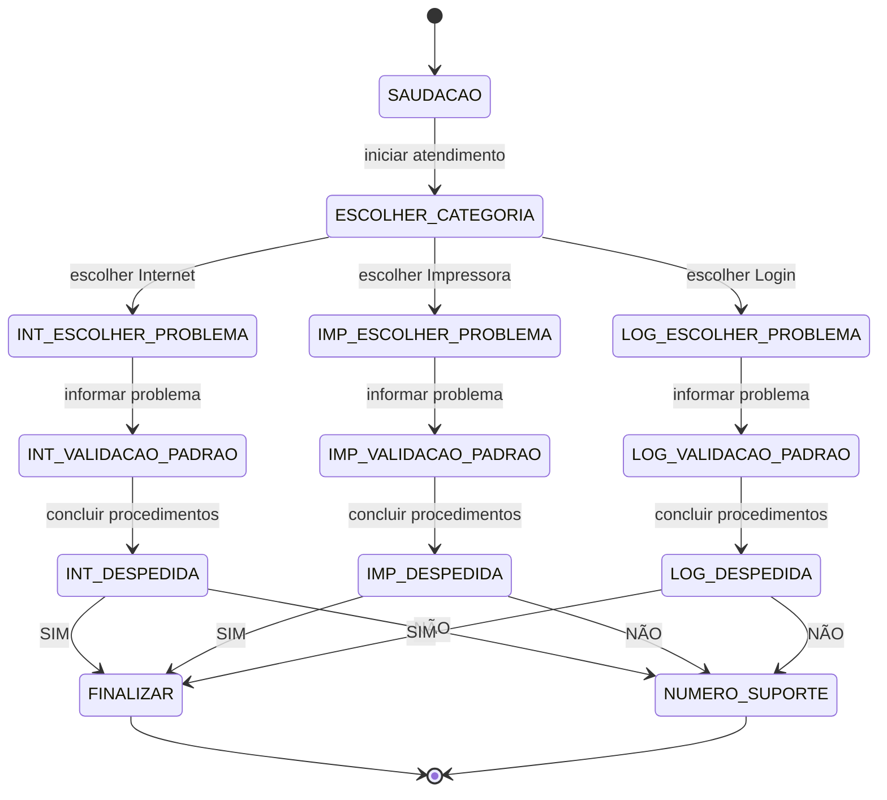

# Chatbot de Suporte Basico com Autômato Finito Determinístico (DFA)

## 🎯 Objetivo
Demonstrar estados, transições e ações usando um DFA que guia o usuário da saudação até a identificação e solução primária do seu problema técnico (Internet, Impressora ou Login no 365) e finalização.

---

## Diagrama de Estados (Mermaid)

---

## 📊 Tabela de Estados e Transições
| **Estado**                | **Ação do Usuário**                  | **Próximo Estado**           |
|---------------------------|--------------------------------------|------------------------------|
| SAUDACAO                 | iniciar atendimento                 | ESCOLHER_CATEGORIA          |
| ESCOLHER_CATEGORIA       | escolher Internet                   | INT_ESCOLHER_PROBLEMA       |
| ESCOLHER_CATEGORIA       | escolher Impressora                 | IMP_ESCOLHER_PROBLEMA       |
| ESCOLHER_CATEGORIA       | escolher Login                      | LOG_ESCOLHER_PROBLEMA       |
| INT_ESCOLHER_PROBLEMA    | informar problema de Internet       | INT_VALIDACAO_PADRAO        |
| INT_VALIDACAO_PADRAO     | concluir procedimentos              | INT_DESPEDIDA               |
| INT_DESPEDIDA            | SIM                                 | FINALIZAR                   |
| INT_DESPEDIDA            | NÃO                                 | NUMERO_SUPORTE              |
| IMP_ESCOLHER_PROBLEMA    | informar problema de Impressora     | IMP_VALIDACAO_PADRAO        |
| IMP_VALIDACAO_PADRAO     | concluir procedimentos              | IMP_DESPEDIDA               |
| IMP_DESPEDIDA            | SIM                                 | FINALIZAR                   |
| IMP_DESPEDIDA            | NÃO                                 | NUMERO_SUPORTE              |
| LOG_ESCOLHER_PROBLEMA    | informar problema de Login          | LOG_VALIDACAO_PADRAO        |
| LOG_VALIDACAO_PADRAO     | concluir procedimentos              | LOG_DESPEDIDA               |
| LOG_DESPEDIDA            | SIM                                 | FINALIZAR                   |
| LOG_DESPEDIDA            | NÃO                                 | NUMERO_SUPORTE              |
| FINALIZAR                | -                                   | FIM                          |
| NUMERO_SUPORTE           | -                                   | FIM                          |

---

## 💬 Exemplos de Conversas

### ✅ Exemplo 1 — Internet, problema resolvido (SIM → FINALIZAR)
**Bot (SAUDACAO):** Olá! Bem-vindo ao suporte. Escolha uma categoria: Internet, Impressora ou Login.  
**Usuário:** Internet  
**Bot (ESCOLHER_PROBLEMA):** Qual é o problema com a Internet?  
**Usuário:** A conexão está lenta.  
**Bot (Validacao Padrao):** Tente reiniciar o roteador e verificar os cabos. O problema foi resolvido?  
**Usuário:** Sim.  
**Bot (DESPEDIDA → FINALIZAR):** Obrigado por usar nosso suporte. Até mais!  
**(FIM)**

---

### ✅ Exemplo 2 — Impressora, problema não resolvido (NÃO → NUMERO_SUPORTE)
**Bot (SAUDACAO):** Olá! Bem-vindo ao suporte. Escolha uma categoria: Internet, Impressora ou Login.  
**Usuário:** Impressora  
**Bot (ESCOLHER_PROBLEMA):** Qual é o problema com a impressora?  
**Usuário:** Não está imprimindo.  
**Bot (Validacao Padrao):** Verifique se está ligada e conectada. O problema foi resolvido?  
**Usuário:** Não.  
**Bot (DESPEDIDA → NUMERO_SUPORTE):** Entre em contato com o suporte: (xx) xxxx-xxxx. Obrigado!  
**(FIM)**

---

### ✅ Exemplo 3 — Login, problema resolvido (SIM → FINALIZAR)
**Bot (SAUDACAO):** Olá! Bem-vindo ao suporte. Escolha uma categoria: Internet, Impressora ou Login.  
**Usuário:** Login  
**Bot (ESCOLHER_PROBLEMA):** Qual é o problema com o login?  
**Usuário:** Esqueci minha senha.  
**Bot (Validacao Padrao):** Acesse o link de recuperação e redefina sua senha. O problema foi resolvido?  
**Usuário:** Sim.  
**Bot (DESPEDIDA → FINALIZAR):** Atendimento concluído. Obrigado!  
**(FIM)**
